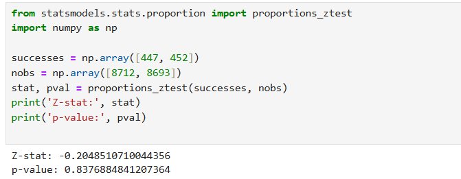

# A/B Test #1 — Onboarding Before Paywall
**Product:** Mobile meditation app  
**Focus:** Conversion & revenue impact of adding onboarding screens prior to the paywall

---

## Goal
Evaluate whether adding onboarding screens before the paywall increases the **overall conversion to first purchase** (primary metric: `CR_total`) among new users, without degrading monetization (primary business constraint: `ARPU`).

Business objective: determine if the onboarding flow produces a net commercial benefit (more paying users and/or higher ARPU) or creates friction that reduces overall revenue.

---

## Technics Used
- Metric definitions:
  - **Primary:** `CR_total = purchases / new_users`
  - **Secondary:** `CR_to_paywall = paywall_views / new_users`, `CR_purchase = purchases / paywall_views`, `ARPU = total_revenue / new_users`
- Sample size calculation with Evan Miller sample-size calculator (proportion test)
- Statistical testing:
  - Two-proportion Z-test (or χ² test for independence) for conversion rates
  - p-value threshold: α = 0.05
- Experiment design:
  - Randomized 50/50 split (Control: current flow, Treatment: onboarding + paywall)
  - Inclusion: new users (first app open)
  - Exclusion: returning users / contaminated exposures
- Revenue check and unit-economics validation

---

## Baseline & Sample Size
- Baseline total conversion (`CR_total`): **4.9% (0.049)**  
- Minimum Detectable Effect (MDE): **0.5 percentage points absolute** (~10% relative uplift)  
- Significance level: **α = 0.05**; Power: **0.80**

**Sample size (Evan Miller)** → **≈ 29,680 users per variant**  
- Control (A): ≈ 29,680  
- Treatment (B): ≈ 29,680  
- Total ≈ 59,360

Traffic & duration:
- New users per day ≈ **2,000**  
- Per-group per day ≈ **1,000** (50/50 split)  
- Required duration ≈ **29–30 days**

- Reference calculator: https://www.evanmiller.org/ab-testing/sample-size.html#!4.9;80;5;0.5;0
- 

---

## Results (experiment data)
**Traffic in the experiment (observed sample):**  
- Control users: **8,712**  
- Treatment users: **8,693**

**Raw funnel / conversion numbers**
- Paywall views:
  - Control: **3,180** → `CR_to_paywall = 3,180 / 8,712 = 36.5%`
  - Treatment: **2,096** → `CR_to_paywall = 2,096 / 8,693 = 24.1%`
  - Change: **-12.4 percentage points** (substantial drop)
- Purchase among paywall viewers:
  - Control purchases: **447** → `CR_purchase = 447 / 3,180 = 14.06%`
  - Treatment purchases: **452** → `CR_purchase = 452 / 2,096 = 21.6%`
  - Change: **+7.5 percentage points** (improvement among those who reached paywall)
- Overall purchase rate (`CR_total`):
  - Control: `447 / 8,712 = 5.13%`
  - Treatment: `452 / 8,693 = 5.20%`
  - Absolute uplift: **+0.07 percentage points**

**Statistical test**, **(Python)**
- Two-proportion test (Z-test):
- - 
  - p-value ≈ **0.84**
  - Conclusion: **not statistically significant** (p ≫ 0.05)

**ARPU**
- Price per purchase: **$7.99** (same for both groups)
- Revenue:
  - Control revenue ≈ `447 × 7.99`
  - Treatment revenue ≈ `452 × 7.99`
- ARPU difference ≈ negligible → **no economic improvement**

---

## Final Result (summary)
- Onboarding **reduced** the proportion of users who reach the paywall (large negative effect).  
- Onboarding **increased** purchase probability among those who reached paywall.  
- Net effect on total conversions (`CR_total`) is **approximately zero** and **statistically insignificant**.  
- **ARPU did not increase.**
- **Business conclusion:** the test is **NOT successful**; do **not** roll out the current onboarding to all users.

---

## Interpretation & Recommendations
- Onboarding creates friction: many users drop out before the paywall. Although those who reach paywall are more likely to purchase, losses at the top of the funnel negate this benefit.
- Recommended next steps:
  1. **Do not roll out globally**.
  2. Iteratively **redesign onboarding**: shorten screens, tighten messaging, reduce steps.
  3. Test **hybrid flows**: show 1–2 onboarding screens + paywall; allow skip; or show onboarding after initial trial.
  4. **Segmented rollout**: test onboarding on specific cohorts (e.g., high-intent channels) to reduce negative impact on general funnel.
  
---

