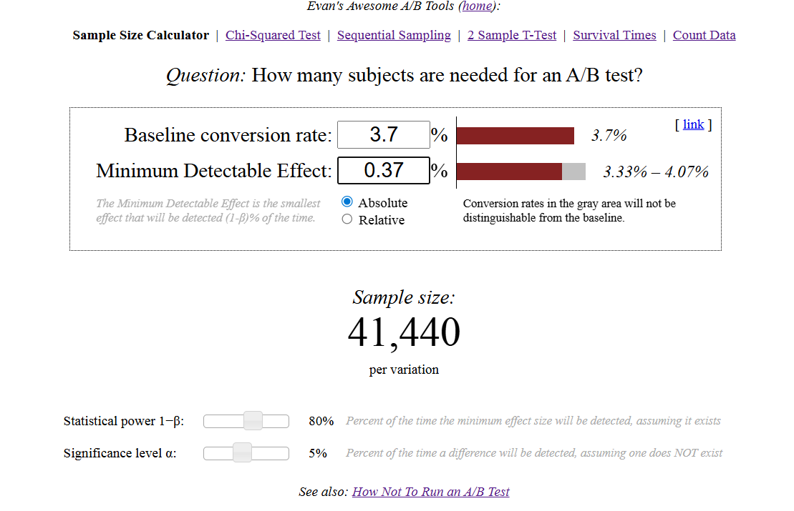

# A/B Test #2 — Introducing a $9.99 Pricing Tier

**Product:** Online education subscription platform  
**Focus:** Impact of introducing a new low-cost tier ($9.99/month) on conversion and revenue  
**Folder:** `AB-Testing/Test-2-Pricing/`

---

## Goal
Evaluate whether adding a lower-priced subscription tier improves:
- First-purchase conversion (CVR)
- ARPU (Average Revenue Per User)
- Total revenue

Business objective: attract more paying users without harming premium-plan performance.

---

## Technics Used
- Randomized A/B test (50/50 split)
- Metrics: CVR, ARPU, ARPPU, revenue uplift, cannibalization share
- Sample size calculation (Evan Miller calculator)
- Two-proportion Z-test (α = 0.05)
- Pricing and revenue decomposition
- Segment comparison across channels

---

## Sample Size & Experiment Design
Baseline CVR: 3.7%  
MDE (assumed uplift): +10% relative  
Significance: 0.05  
Power: 80%  

Required sample size: **≈41,500 users per group**  

Traffic: 3,000 users/day → 1,500 per group  
Duration: **≈28 days**

- Calculator: https://www.evanmiller.org/ab-testing/sample-size.html
- 

---

## Results (Observed Data)

### Traffic
- Control (A): 13,623 users  
- Treatment (B): 14,012 users

### Purchases
- Control: 411 purchases ($29.99)
- Treatment:
  - Premium $29.99: 420
  - Basic $9.99: 232  
  - **Total: 652**

---

## Conversion Metrics

### Premium Plan CVR ($29.99)
- Control: 3.01%
- Treatment: 3.00%

→ No negative impact.

### Basic Tier CVR ($9.99)
- 1.66% (Treatment only)

### Total CVR
Control: 3.01%  
Treatment: 4.65%  

**Uplift: +54%**

---

## Revenue Metrics

### Revenue
- Control: **$12,333.89**
- Treatment: **$14,913.48**

Revenue uplift: **+20.9%**

### ARPU
- Control: $0.90  
- Treatment: $1.06  
ARPU uplift: **+17.7%**

### ARPPU
- Premium (Control): $64.48  
- Premium (Treatment): $62.68  
- Basic (Treatment): $27.27

---

## Cannibalization Check
Share inside Treatment:
- Premium: 64.4%
- Basic: 35.6%

Interpretation: new tier adds buyers rather than pulling them from premium.

---

## Two-proportion test (Z-test)
Z ≈ –7.07  
p-value ≈ 1.54 × 10⁻¹²  
- 
  
**p << 0.05 → statistically significant difference.**

---

## Result (Summary)
- CVR increased from **3.01% → 4.65%**
- ARPU increased by **17.7%**
- Revenue increased by **20.9%**
- Premium plan remained stable
- Cannibalization is low and acceptable
- Effect is statistically significant

**Conclusion:** The $9.99 tier works. Recommendation: launch.

---

## Interpretation
The cheaper tier reduces friction for first-time buyers, enlarging the paying audience. The premium tier stays healthy, and the revenue mix improves, creating a more flexible pricing strategy and a higher revenue baseline.

---

## Recommended Next Steps
1. Evaluate LTV of $9.99 users  
2. Promote upgrades to premium tier  
3. Test additional price points  
4. Segment pricing tests by acquisition channel  
5. Analyze cohort performance over time  

---
