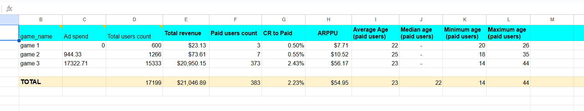
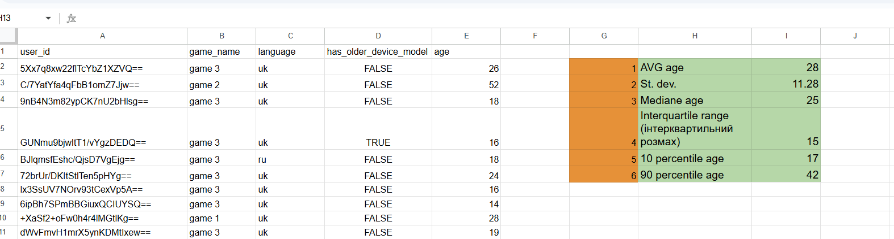
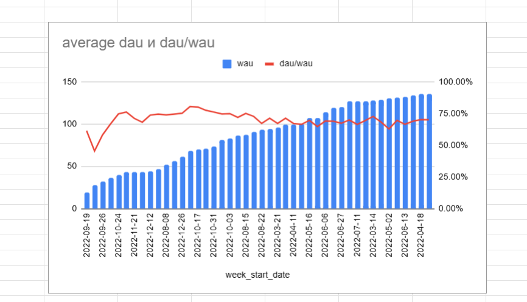
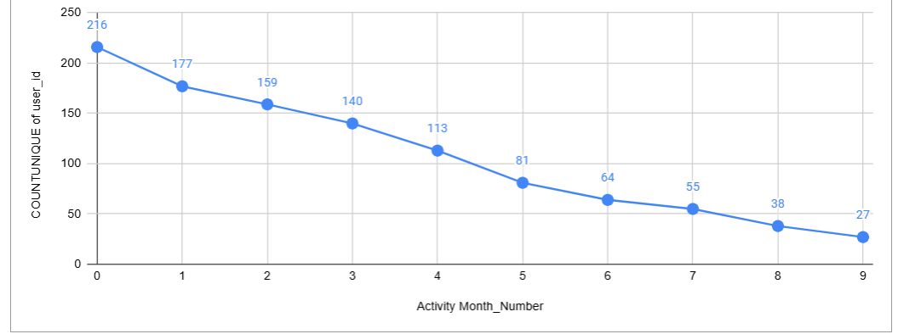
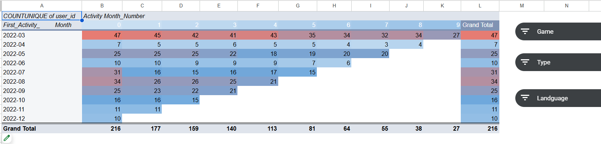

# 📊 Google Sheets Practice Projects

This project focuses on practicing **data analysis and product metrics** using **Google Sheets**.  
The tasks cover calculating KPIs, analyzing variability and engagement, applying regression for forecasting, building pivot tables, and performing cohort analysis.  
The work was performed entirely in **Google Sheets**, combining formulas, functions, and visualizations.  

> Note: Screenshots show highlights; full dataset, formulas, and tables are available via the Google Sheets link.
- **Link to Google Sheets:
- https://docs.google.com/spreadsheets/d/1uTgfxSKHaQ-tkvXd8SsqeAP8Oi1yI34PYsFj41xYick/edit?usp=sharing
- https://docs.google.com/spreadsheets/d/1i4trDLumkYXpb2Kbo7wsAfOTuDeMwjPRPnyI3naUarU/edit?usp=sharing
 

## 📊 Tasks Overview  

### 1️⃣ Product Metrics Analysis
- **Goal:** Calculate core **product metrics** (Total Revenue, Paid Users Count, CR to Paid, ARPPU, Average & Median Age, Min/Max Age).  
This task establishes a foundation for evaluating the performance of games and their user bases.  
- **Techniques used:** SUMIF, COUNTIF, AVERAGEIF, MEDIAN, conditional aggregations.  
- **Result:** Built a consolidated product metrics table per game, plus totals across all games.  
- **Screenshots:** 
- **Interpretation:**  
These metrics help analyze monetization efficiency (ARPPU, CR to Paid) and understand the demographics of paying users.  

---

### 2️⃣ Variability and Engagement Metrics  

- **Goal:** Measure **variability of user ages** and calculate **engagement metrics** (DAU, WAU, stickiness).  
This provides insight into user activity distribution and product health.  
- **Techniques used:** AVERAGE, STDEV, MEDIAN, PERCENTILE, COUNTUNIQUEIFS, SUMIF, DATE formulas.  
- **Result:** Generated statistical variability measures and built DAU/WAU sheets with stickiness ratio.  
- **Screenshots:** 
- [DAU, WAU, and stickiness](assets/task2.1.png)
  
- **Interpretation:**  
The variability analysis showed user age spread, while DAU/WAU revealed retention trends and stickiness as a key engagement metric.  

---

### 3️⃣ Linear Regression & Charts
- **Goal:** Use linear regression to forecast metrics and build charts.
- **Tools/Functions:** FORECAST, ROUND, chart tools (bar, pie, combo, trendline)
- **Tasks:** 
  - Prepare fixed and sorted values for WAU.
  - Forecast DAU and WAU for new weeks.
  - Build 4 charts: bar chart, pie chart, combo chart, line chart with trendline.
- **Result:** Visualized forecasts and user trends.
- **Screenshots:** 

---

### 4️⃣ Text Functions, Dates & Pivot Tables
- **Goal:** Work with text functions, dates, and pivot tables.
- **Tools/Functions:** SPLIT, VLOOKUP, MINIFS, pivot tables, line charts
- **Tasks:** 
  - Split activity names and categorize them.
  - Extract user language and activity months.
  - Build cohort analysis using pivot tables.
  - Visualize activity trends with line charts.
- **Result:** Cleaned dataset with pivot tables and charts.
- **Screenshots:** 

---

### 5️⃣ Cohort Analysis & Retention
- **Goal:** Build cohort tables and calculate retention rates.
- **Tools/Functions:** Pivot tables, IF, absolute references, conditional formatting
- **Tasks:** 
  - Create pivot tables by first activity month.
  - Add slicers for game, activity type, and user language.
  - Calculate retention rates and apply gradient formatting.
- **Result:** Interactive cohort analysis and retention insights.
- **Screenshots:** 

---

## 📌 Summary
This project demonstrates my practical skills in Google Sheets for data analytics, including:  
- Calculating product and user metrics  
- Analyzing engagement and variability  
- Forecasting with linear regression  
- Working with text functions, dates, and pivot tables  
- Building charts and cohort analyses
