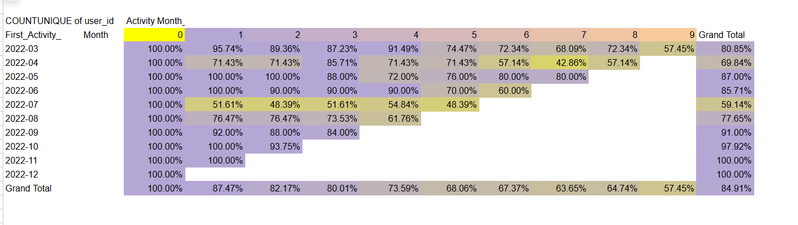

# 📊 Google Sheets Practice Projects

This project focuses on practicing **data analysis and product metrics** using **Google Sheets**.  
The tasks cover calculating KPIs, analyzing variability and engagement, applying regression for forecasting, building pivot tables, and performing cohort analysis.  
The work was performed entirely in **Google Sheets**, combining formulas, functions, and visualizations.  

> Note: Screenshots show highlights; full dataset, formulas, and tables are available via the Google Sheets link.
- **Link to Google Sheets:
- https://docs.google.com/spreadsheets/d/1uTgfxSKHaQ-tkvXd8SsqeAP8Oi1yI34PYsFj41xYick/edit?usp=sharing
- https://docs.google.com/spreadsheets/d/1i4trDLumkYXpb2Kbo7wsAfOTuDeMwjPRPnyI3naUarU/edit?usp=sharing
 

## 📊 Tasks Overview  

### 1️⃣ Product Metrics Analysis
- **Goal:** Calculate core **product metrics** (Total Revenue, Paid Users Count, CR to Paid, ARPPU, Average & Median Age, Min/Max Age).  
This task establishes a foundation for evaluating the performance of games and their user bases.  
- **Techniques used:** SUMIF, COUNTIF, AVERAGEIF, MEDIAN, conditional aggregations.  
- **Result:** Built a consolidated product metrics table per game, plus totals across all games.  
- **Screenshots:** 
- **Interpretation:**  
These metrics help analyze monetization efficiency (ARPPU, CR to Paid) and understand the demographics of paying users.  

---

### 2️⃣ Variability and Engagement Metrics  
- **Goal:** Measure **variability of user ages** and calculate **engagement metrics** (DAU, WAU, stickiness).  
This provides insight into user activity distribution and product health.  
- **Techniques used:** AVERAGE, STDEV, MEDIAN, PERCENTILE, COUNTUNIQUEIFS, SUMIF, DATE formulas.  
- **Result:** Generated statistical variability measures and built DAU/WAU sheets with stickiness ratio.  
- **Screenshots:** 
- [DAU, WAU, and stickiness](assets/task2.1.png)
- **Interpretation:**  
The variability analysis showed user age spread, while DAU/WAU revealed retention trends and stickiness as a key engagement metric.  

---

### 3️⃣ Forecasting with Linear Regression  
- **Goal:** Apply **linear regression** to forecast DAU and WAU, and visualize engagement trends.  
This demonstrates how historical data can be used for predictive insights.  
- **Techniques used:** FORECAST, ROUND, UNIQUE, sorting data, chart building in Google Sheets.  
- **Result:** Extended DAU/WAU series with 20 future weeks and built multiple charts (bar, pie, line, combo chart with trendline).  
- **Screenshots:** 
- [forecast DAU and WAU](assets/task3.1.png)
- [forecast DAU and WAU1](assets/task3.2.png)
- **Interpretation:**  
Forecasting allowed to anticipate user activity trends, while charts made the results more interpretable for business decision-making.  

---

### 4️⃣ Text Functions, Dates & Pivot Tables
- **Goal:** Use **text/date functions** to transform activity data and build a **pivot table for cohort analysis preparation**.  
This task enhances data preprocessing and cohort segmentation skills.  
- **Techniques used:** SPLIT, VLOOKUP, TEXT, MINIFS, derived date columns, pivot table creation.  
- **Result:** Built enriched activity dataset with game/activity types, user language, activity month, and activity month number.  
- **Screenshots:** 
- **Interpretation:**  
By transforming data and categorizing activities, it became possible to group users into cohorts and analyze activity progression over months.  

---

### 5️⃣ Cohort Analysis & Retention
- **Goal:** Perform **cohort analysis** based on the first activity month and calculate **retention rates**.  
This highlights how user cohorts behave over time.  
- **Techniques used:** Pivot tables, IF formulas, retention rate calculation, conditional formatting.  
- **Result:** Built two cohort tables with filters (game, activity type, language) and retention heatmaps.  
- **Screenshots:** 
- 
- **Interpretation:**  
Cohort analysis showed user retention patterns and helped compare how long users from different acquisition months remained active.  

---

## 📌 Summary
This Google Sheets project demonstrates:  
- Strong command of **formulas and functions** (SUMIF, AVERAGEIF, COUNTIF, FORECAST, etc.).  
- Ability to calculate **key product and engagement metrics**.  
- Application of **variability measures** (standard deviation, percentiles).  
- Use of **forecasting techniques** with linear regression.  
- Creation of **pivot tables** and **cohort analysis** with retention heatmaps.  
- Data visualization through **charts** for clearer communication of insights.  

By combining these skills, the project highlights practical applications of Google Sheets for product analytics and user engagement evaluation.  
