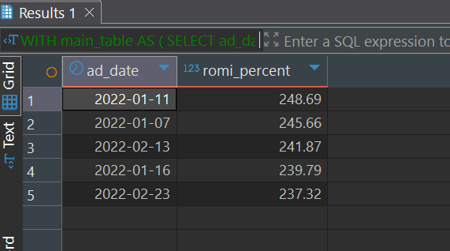
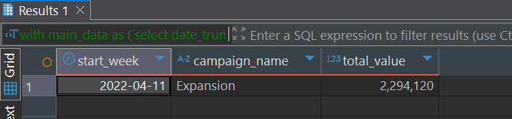
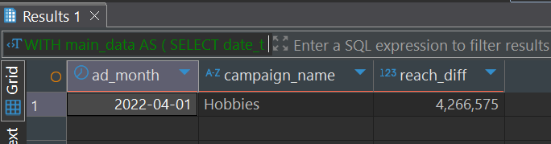
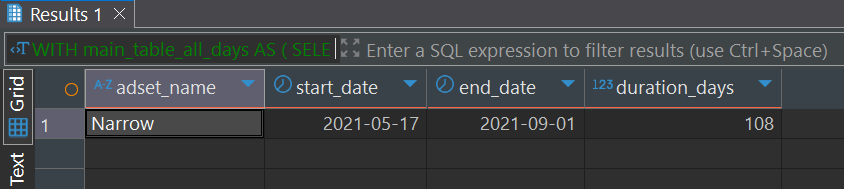

# SQL Advertising Campaign Analysis  

This project focuses on analyzing online advertising campaigns across **Google** and **Facebook**.  
The tasks include calculating aggregated metrics, identifying top-performing days, analyzing campaign efficiency, and investigating continuous ad set activity.  

The work was performed in **PostgreSQL (via DBeaver)** using the dataset `ads_analysis_goit_course`.  

---

## 📊 Tasks Overview

### Task 1. Daily Spend Aggregates  

**Goal:** Calculate and compare the **average, maximum, and minimum daily spend** across Google and Facebook campaigns.  
This provides a baseline for understanding spending behavior and detecting unusually high or low outliers.  

**SQL techniques used:** Aggregate functions (AVG, MAX, MIN), GROUP BY,  UNION ALL, filtering by platform.  

**Result:** Identified daily spending ranges for each platform, highlighting spending variability.  

👉 [View Script-1](./scripts/Script-1.sql)

**Example Output:**  
  

**Interpretation:**  
These results help evaluate cost control. By comparing Google vs. Facebook, it becomes clear which platform tends to have more consistent or volatile spending patterns.  

---

### Task 2. Top-5 Days by ROMI  

**Goal:** Identify the **top-5 days** with the highest ROMI values across Google and Facebook ads.  
This helps to analyze which specific days brought the **best return on marketing investments**.  

**SQL techniques used:** WITH, filtering data, SUM, calculating ratios, ORDER BY ... DESC LIMIT.  

**Result:** Found the five days with the most efficient ad spend.  

👉 [View Script-2](./scripts/Script-2.sql)

**Example Output:**  
  

**Interpretation:**  
Such analysis highlights which days performed best, helping in planning budgets for future campaigns and reallocating spend to high-return periods.  

---

### Task 3. Weekly Value Leader  

**Goal:** Identify the **campaign with the highest total weekly value** across all advertising activities.  
This shows which campaign generated the greatest overall contribution in a single week.  

**SQL techniques used:** DATE_TRUNC for weekly grouping, SUM for value aggregation, ORDER BY DESC LIMIT.  

**Result:** Found the top-performing campaign and its respective record week.  

👉 [View Script-3](./scripts/Script-3.sql) 

**Example Output:**  
  

**Interpretation:**  
Knowing which campaign achieved the highest weekly results allows marketers to replicate strategies that worked and investigate conditions that contributed to peak performance.  

---

### Task 4. Highest Month-to-Month Reach Growth  

**Goal:** Determine the **campaign with the greatest month-over-month reach growth**.  
This analysis highlights campaigns that experienced rapid audience expansion.  

**SQL techniques used:** DATE_TRUNC for months, SUM for reach calculation, LAG() for month-to-month comparison, ORDER BY growth DESC LIMIT.  

**Result:** Identified the campaign with the sharpest audience growth.  

👉 [View Script-4](./scripts/Script-4.sql) 

**Example Output:**  
  

**Interpretation:**  
These insights are valuable for spotting campaigns that gained strong momentum, helping to analyze why they grew quickly and whether such growth is sustainable.  

---

### Task 5. Longest Continuous Adset Activity  

**Goal:** Find the **ad set (from both Google and Facebook)** that ran for the longest uninterrupted sequence of days.  
This shows persistence in daily campaign exposure.  

**SQL techniques used:** Window functions (LAG), CASE WHEN, grouping sequences, calculating streak lengths.  

**Result:** Identified the ad set with the longest continuous run.  

👉 [View Script-5](./scripts/Script-5.sql)

**Example Output:**  
  

**Interpretation:**  
Detecting long-running ad sets helps evaluate whether consistent exposure improves engagement, conversions, or brand awareness over time.  

---

## 📊 Summary  

This SQL project demonstrates:  
- Proficiency in **PostgreSQL queries** and **data analysis**.  
- Ability to use **aggregations, ratios, window functions, and time-based grouping**.  
- Practical application of SQL for **marketing performance analysis**.  

By exploring different perspectives (spending, ROMI, weekly value, growth, and continuity), the project shows how SQL can uncover actionable insights for optimizing campaigns.  

---

## 📂 Repository Structure

```
SQL/
├── README.md
├── scripts/
│   ├── Script-1.sql
│   ├── Script-2.sql
│   ├── Script-3.sql
│   ├── Script-4.sql
│   └── Script-5.sql
└── assets/ # Screenshots of results

```

